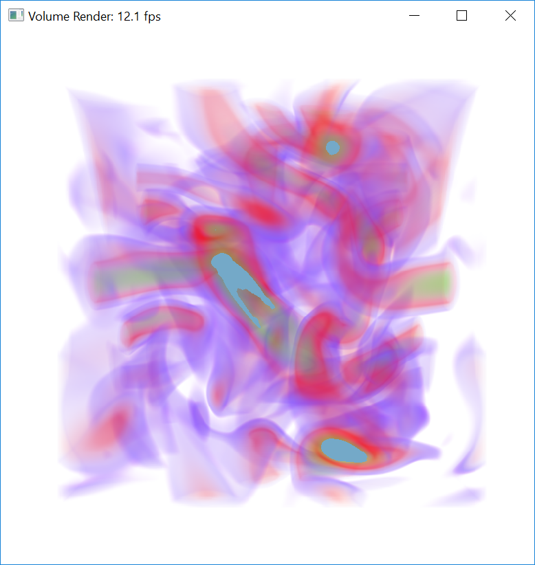
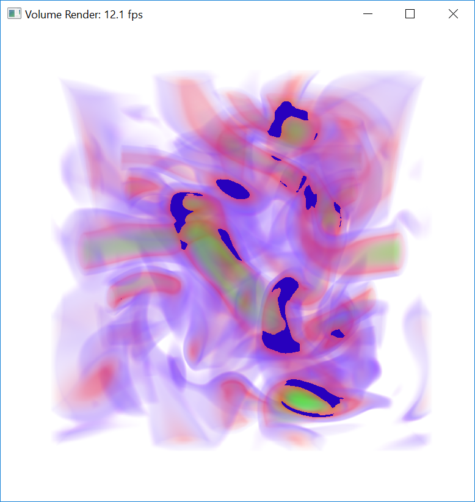
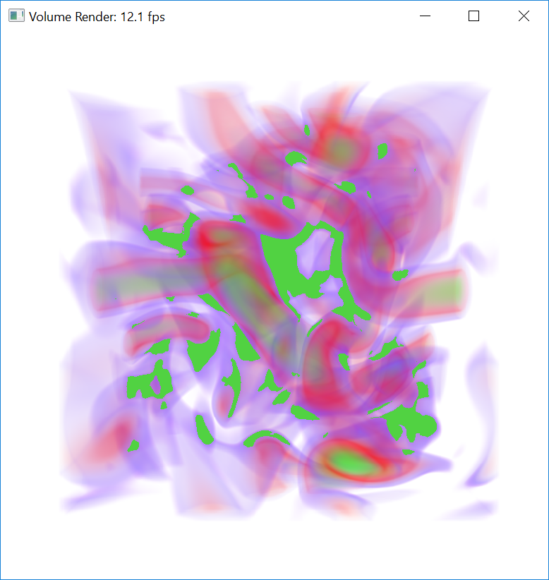
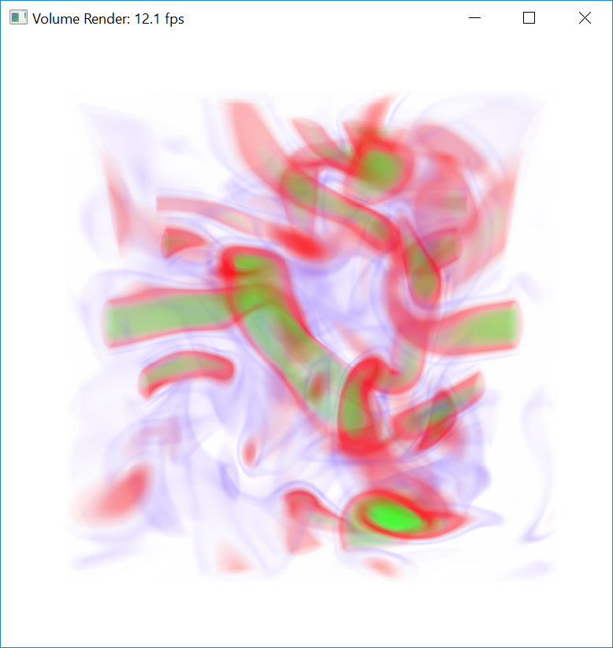
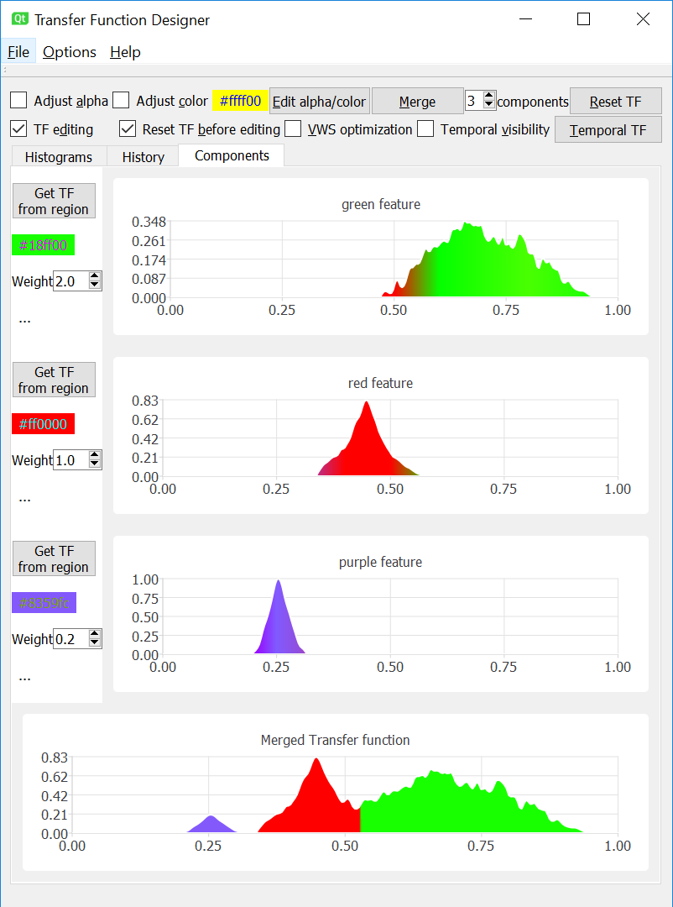

# cuda-visibility

## This program has been successfully built with the following environment:
Visual Studio 2017  
CUDA Toolkit 9.2  
Qt 5.11.1  
ArrayFire 3.6  

## Transfer function enhancements for volume visualization using relative visibility histograms

Select the green, red and purple features for intuitive transfer function editing

Merge the three features with user-specified weights

